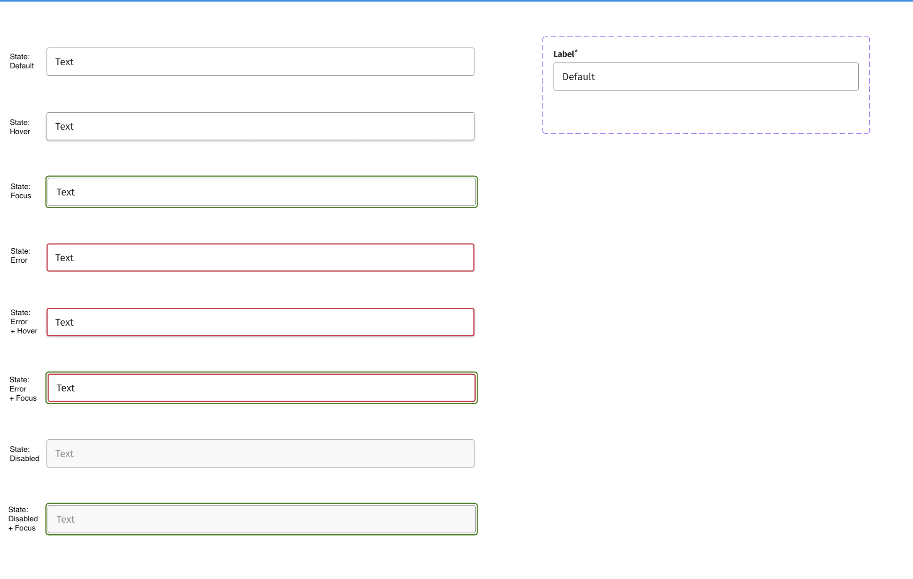

# Frontend Engineer: Technical Challenge

## Task

We want you to write a controlled form component called `MoneyInput` in React with the following criteria:

- The user can input a decimal number (in Euro).
- On change the component will convert the value to integer (in Cents) and emit new value by running the appropriate handler and log the new value in console.
- On blur the component will convert the value to integer (in Cents) and emit new value by running the appropriate handler and log the new value in console.
- Whenever a new value is provided (integer, in Cents) through the `value` prop, the value of the input field will be updated with the new decimal number (in Euro).
- The component looks similar to the design in the screenshot below.
- Bonus: The component is documented in Storybook.
- Bonus: The component's interface besides the changes stemming from the functionality described above is identical to the interface of the HTML input element.

### Design

### Additional notes

- Suppose that the component gets a `locale` passed as a prop (e.g. `en` or `de`), that you can use to format the string.
- You may use the tokens provided in `tokens.css` to style the component.
- The code should be placed in the `src/MoneyInput` directory, there is some boilerplate code there created for your convenience.

## Submit your solution

You can provide your solution either

- as a zipped file containing the code or
- as a link to a fork of this repository.
